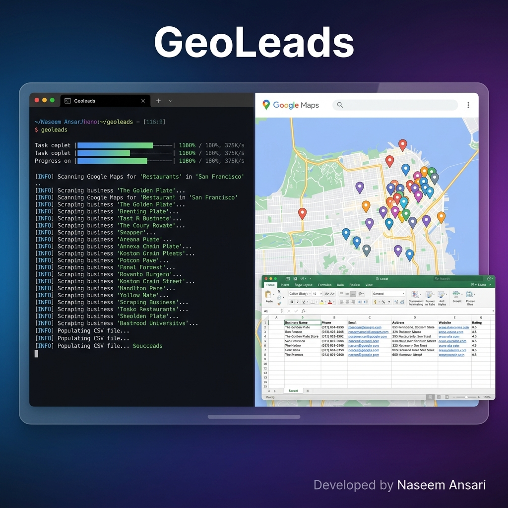

<div align="center">
  <h1>🗺️ GeoLeads</h1>
  <p><strong>Enterprise-grade CLI tool for extracting business leads from Google Maps</strong></p>
  <br />
  


  [](https://www.npmjs.com/package/geoleads)
  [](https://opensource.org/licenses/MIT)
  [](https://nodejs.org/)
</div>

<hr>

## 📖 Overview

**GeoLeads** is a powerful, highly-optimized command-line interface (CLI) designed for local and international lead generation. Built dynamically on top of Node.js and Puppeteer, it navigates Google Maps using advanced stealth techniques to effortlessly extract rich business data and export it directly into structured, ready-to-use Excel (`.xlsx`) files.

Version 1.3.0 introduces a major architecture shift, migrating from traditional Google Search parsing to **direct Google Maps navigation**. This ensures 100% bypass of "Local Pack" UI changes and provides much higher reliability for data extraction.

---

## ✨ Features

- 🕵️ **Advanced Stealth Automation**: Utilizes `puppeteer-extra-plugin-stealth` with randomized User-Agent rotation and human-like delay heuristics to bypass basic bot-detection mechanisms.
- 🏢 **Direct Maps Navigation**: Navigates directly to `google.com/maps` to bypass the fragile Google Search "Local Pack" UI, ensuring robust extraction even when Google updates its search results page.
- 🏢 **Deep Data Extraction**: Scrapes business names, addresses, phone numbers, and websites using reliable attribute-based selectors (`data-item-id`).
- 📄 **Infinite Scroll Support**: Automatically handles Maps feed scrolling to load and extract all available listings for a given query.
- 📧 **Intelligent Email Discovery**: Automatically crawls discovered business websites (scanning homepages, `/contact`, and `/about` pages) using heuristic regex matching to find valid email addresses.
- ⚡ **Bulk Lead Generation**: Built-in multi-keyword and multi-city processing capabilities with worker pools to scrape thousands of leads in a single run.
- 📊 **Enterprise Excel Exports**: Generates beautiful `.xlsx` files with structured columns, frozen headers, clickable hyperlinked cells, and a built-in **Remarks** column for calling/sales notes.
- 🔄 **Smart Deduplication**: Prevents duplicate entries based on business names inside processing batches.

---

## 🚀 Installation

GeoLeads requires **Node.js (v18 or higher)**. Installing it globally allows you to run the `geoleads` command from any terminal directory.

```bash
# Install globally via npm
npm install -g geoleads
```

Or run directly without installing:

```bash
# Run with npx
npx geoleads "restaurants in Delhi" --limit=20
```

---

## 💻 Usage & Workflows

GeoLeads provides an intuitive CLI. At its simplest, provide a search query and a limit.

### Basic Single-Query Scraping

Ideal for targeted, one-off searches.

```bash
geoleads "restaurants in Delhi" --limit=20 --output=delhi_restaurants.xlsx
```

### Visual Debugging (Headful Mode)

If you want to see the automation in real-time, enable `--headful` mode to watch the browser window.

```bash
geoleads "digital marketing agencies in London" --limit=10 --headful
```

### Skip Email Scraping (Faster)

If you only need business details (name, phone, address, website) and want to skip the slower email discovery process:

```bash
geoleads "wedding planners in Bangalore" --limit=50 --skip-emails
```

---

### 🔥 Advanced: Multi-City Batch Mode

For large-scale lead generation, GeoLeads supports variables in your query. Create a text file containing city names (one per line) and use the `[city]` placeholder.

**`cities.txt`**
```text
Mumbai
Bangalore
Pune
```

**Command:**
```bash
geoleads "gym in [city]" --params=cities.txt --limit=50 --output=indian_gyms.xlsx
```

*This will systematically scrape 50 gyms from Mumbai, then 50 from Bangalore, etc., exporting the results into a single Excel workbook containing multiple colored tabs (one per city).*

---

### 🚀 Bulk: Multi-Keyword × Multi-City Mode

The most powerful mode for generating massive lead lists. Requires a `keywords.txt` and a `cities.txt` file.

**`keywords.txt`**
```text
Nail Studio
Hair Salon
Spa
```

**Command:**
```bash
geoleads "[keyword] in [city]" -k keywords.txt -p cities.txt -l 20 -c 5 --fast --skip-emails -o bulk_leads.xlsx
```

- `-k` Path to keywords file.
- `-p` Path to cities file.
- `-c 5` Runs 5 parallel browsers for maximum throughput.
- `-o bulk_leads.xlsx` Generates one Excel file per keyword, organized by city tabs.

---

## 🛠️ Command Line Reference

| Flag | Alias | Default | Description |
| :--- | :---: | :---: | :--- |
| `query` | | (Required) | The search query (e.g. `"plumbers in Chicago"` or `"[keyword] in [city]"`) |
| `--limit` | `-l` | `10` | Maximum number of business listings to retrieve per query. |
| `--output`| `-o` | `results.xlsx`| The destination path and filename for the `.xlsx` export. |
| `--headful`| | `false` | Disables headless mode, opening a visible Chrome window. |
| `--params`| `-p` | `undefined` | Path to a `.txt` file containing cities (requires `[city]` in query). |
| `--keywords`| `-k` | `undefined` | Path to a `.txt` file containing keywords (requires `[keyword]` in query). |
| `--concurrency`| `-c`| `1` | Number of simultaneous browsers for batch mode (Max 10). |
| `--fast` | | `false` | Reduces built-in delays by 75% for rapid execution. |
| `--skip-emails`| | `false` | Bypasses navigating to individual websites to locate emails. |
| `--help` | `-h` | | Displays the help menu and examples. |

---

## 📋 Output Data

Each scraped business includes the following fields in the exported Excel file:

| Column | Description |
| :--- | :--- |
| **Business Name** | Name of the business listing |
| **Website** | Business website URL |
| **Phone** | Phone number extracted via `data-item-id` attribute |
| **Email** | Email discovered from business website (if found) |
| **Address** | Full street address from Google Maps |
| **Facebook** | Facebook page URL (if found on business website) |
| **Instagram** | Instagram profile URL (if found) |
| **Twitter** | Twitter/X profile URL (if found) |
| **LinkedIn** | LinkedIn profile URL (if found) |
| **Remarks** | **NEW**: Empty styled column for sales notes and call status |

---

## ⚖️ Disclaimer

> [!WARNING]
> This tool is provided for **educational and academic research purposes only**. Scraping Google Services violates their Terms of Service. The authors assume no liability for misuse, IP bans, or resulting damage. Users must respect website `robots.txt` policies and adhere to local privacy regulations (e.g., GDPR).

---

## 🤝 Contributing

We welcome contributions from the open-source community! 
1. Fork the project.
2. Create your feature branch (`git checkout -b feature/AmazingFeature`).
3. Commit your changes (`git commit -m 'feat: add some AmazingFeature'`).
4. Push to the branch (`git push origin feature/AmazingFeature`).
5. Open a Pull Request.

## 📄 License

Distributed under the MIT License. See `LICENSE` for more information.

<p align="center">
  <i>Built with ❤️ by Naseem Ansari.</i>
</p>
